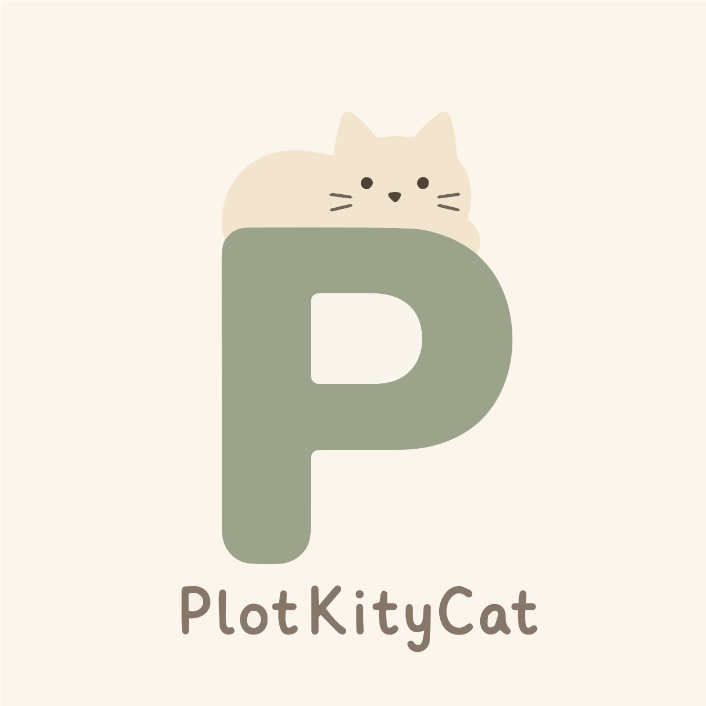

<p align="center">
  <a href="https://github.com/Wingflow/PlotKityCat">
    
  </a>
</p>

<h1 align="center">PlotKityCat</h1>

<p align="center">
  一款专为数学老师打造的 AI-native 可视化教学工具。
</p>

<p align="center">
  
  
  
  
  
</p>

## 简介

PlotKityCat 是一个面向数学教学场景的 AI-native 可视化工具。它基于 Matplotlib 执行绘图代码，支持自然语言生成可视化，并以便携式 runtime 支撑课堂演示与离线分发。

## 视频介绍

https://github.com/user-attachments/assets/df8167a7-d1e9-4f6a-a42d-de15596a4456

## 设计原则

1. **开源**：以可审查、可扩展的技术栈承载教学工具。
2. **美感**：避免传统数学软件沉闷的视觉体验。
3. **AI 原生**：让老师通过自然语言驱动可视化生成，而不是先学编程。

## 功能特性

- **AI 绘图**：通过自然语言描述数学概念，由 AI 生成 Matplotlib 绘图代码。
- **笔记系统**：集成 Markdown 与 LaTeX 公式渲染，绑定代码，看到可视化的结果，更看到可视化的设计。
- **便携运行**：依赖便携 Python runtime，适合 U 盘和教室环境分发。
- **场景包导入导出**：支持 `.pck` 场景包的交换与复用。

## 技术栈

- **前端**: Vue 3, TypeScript, Vite
- **后端**: Go, Wails Framework
- **运行时**: WinPython (NumPy, Matplotlib, SciPy, PyQt5)
- **AI 接口**: OpenAI API / 自定义兼容接口

## 快速开始

1. 下载便携版压缩包。
2. 配置 AI 服务商 API Key。
3. 启动应用并新建场景。
4. 在笔记区输入描述后运行可视化或可视化设计。

## 开发入口

- **Windows**
- **Go**: 1.22+
- **Node.js**: 18+
- **Wails**: v2.x

开发启动：

```powershell
cd frontend
npm install
cd ..
wails dev
```

runtime 打包入口：

```powershell
.\tools\prepare-runtime.ps1 -SourceRuntimeDir <你的 runtime 目录>
```

应用打包入口：

```powershell
.\tools\build-versioned-app.ps1
.\tools\package-release.ps1
.\tools\prepare-update-release.ps1
```

## 文档索引

- 开发与构建总说明： [DEVELOPMENT.md](D:/projects/plotkitycat/DEVELOPMENT.md)
- runtime 分发与重建： [RUNTIME_BUILD.md](D:/projects/plotkitycat/RUNTIME_BUILD.md)
- 在线更新与发布： [UPDATE_RELEASE.md](D:/projects/plotkitycat/UPDATE_RELEASE.md)

## 致谢

- [Matplotlib](https://matplotlib.org/): 本项目核心渲染引擎。
- [ManimCat](https://github.com/Wing900/ManimCat): 提供了开发的基础和灵感。
- [ZoomIt (PowerToys)](https://github.com/microsoft/PowerToys/tree/main/src/modules/ZoomIt): 放映模式辅助功能的实现基础。
## 愿景

推动更多的可视化资源开源开放，让数学教学更清晰、更公平。
