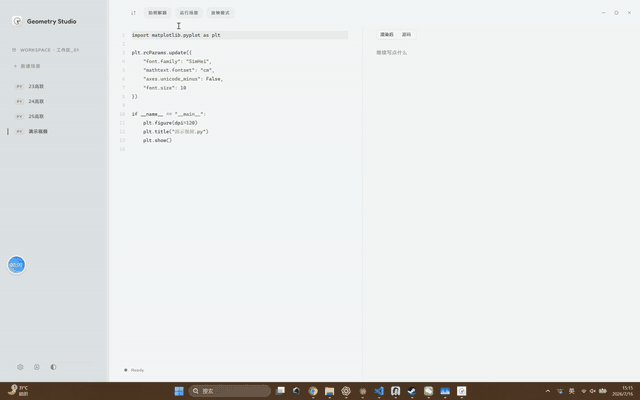
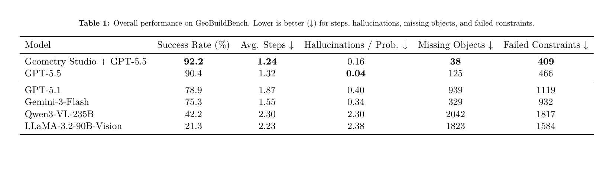

# Geometry Studio

Geometry Studio 是一个面向几何题解题、教学证明和可视化演示的 Windows 桌面工作台。它支持图片或文本输入题目，由单个 VLM ReAct DSL 循环生成可执行几何 DSL，经过运行、渲染和 GeoBuildBench 风格验证后，在交互式 App 中交给教师审核，再生成 Matplotlib 图、中文证明和 Markdown + MathJax 笔记。

最快上手：下载 release 包，解压后运行 `GeometryStudio.exe`。

```powershell
npm install --prefix frontend
npm run build --prefix frontend
go test ./...
wails build -clean
```

## 演示视频

[](Hackathon%E5%B1%95%E7%A4%BA.mp4?raw=1)

点击动态预览可打开完整演示视频。

## 项目亮点

- 图片/文本双入口：可上传题图，也可直接输入几何题文字。
- 单 VLM ReAct DSL 流：VLM 输出 `Thought + Action + DSL`，运行时执行 DSL，验证器把对象/条件得分和失败项反馈给下一轮。
- 教师审核在最后一轮 VLM 候选之后触发：审核面板展示 DSL、验证摘要、渲染图和尝试历史。
- `GeometryConstruction.dslCode` 是权威可执行表示；场景、证明、笔记和代码都围绕最终 DSL 派生。
- Benchmark 模式跳过教师审核，直接对最终 DSL 做 GeoBuildBench 验证和汇总。
- 中文优先输出：题干、标签、证明、解答笔记和课堂提问均面向中文教学场景。
- 可运行图形：生成 Python + Matplotlib 代码，并通过运行检查和必要的自我修正保障可执行。

## 当前核心流程

1. 打开或创建一个场景。
2. 在 AI 设置中配置 OpenAI 兼容接口；图片题建议使用支持视觉输入的模型。
3. 通过拍照解题入口上传题图，或直接输入题干文本。
4. `react_dsl_loop` 迭代生成 DSL，并接收执行、渲染和验证反馈。
5. 当对象得分和条件得分均达到阈值，或达到最大尝试次数后，触发教师审核。
6. 教师接受时沿用最后 DSL；教师修改题意时，对审核后的题意重新运行 DSL ReAct 循环。
7. 编译 DSL 场景，生成 Matplotlib 代码、中文证明、课堂笔记，运行检查后发布到当前场景。

## 工作流节点

```text
react_dsl_loop
teacher_review
post_review_react_loop
scene_compile
matplotlib_code_generate
teaching_proof_generate
runtime_check
self_correct
publish
```

- `react_dsl_loop`：单个 VLM 迭代生成 GeoBuildBench DSL，并根据执行、验证和渲染反馈修正。
- `teacher_review`：暂停交互式流程，交给教师确认最后一轮 DSL 候选、题意和验证反馈。
- `post_review_react_loop`：教师接受则复用 DSL；教师编辑题意则重新运行 DSL ReAct。
- `scene_compile`：从已执行 DSL 派生 GeometryScene 展示模型。
- `matplotlib_code_generate`：把 DSL 场景转换为可运行的中文教学图代码。
- `teaching_proof_generate`：生成中文证明、课堂问题和 Markdown 笔记。
- `runtime_check`：运行生成代码，检查安全性、可执行性和动态控件要求。
- `self_correct`：根据运行错误修复 Matplotlib 代码。
- `publish`：写回最终代码、DSL、场景和笔记。

## Benchmark

GeoBuildBench 测评脚本位于 `tools/geobuildbench_geometry_studio_eval.py`。Benchmark 模式会使用同一套 DSL ReAct 逻辑，但跳过教师审核，并把最终 `dslCode` 直接送入 GeoBuildBench 验证。

```powershell
python tools\geobuildbench_geometry_studio_eval.py --help
```

### 最新测评结果



Geometry Studio 接入 GPT-5.5 后，在 2026-07-17 完成了 489 道题的完整测评，GeoBuildBench 成功率为 **92.2%**，成功题平均使用 **1.24** 步。

为保证与 GeoBuildBench 论文结果的统计口径一致，表格中的 `Missing Objects` 和 `Failed Constraints` 会累计每道题所有有效验证步骤。本次测评共记录 829 次有效验证：全程累计缺失对象 **38** 个、失败约束 **409** 个。`Hallucinations / Prob.` 同样按完整执行过程统计 DSL 执行错误。

完整的最终 DSL 评分与逐题结果见 [`benchmark-results/geobuildbench-geometry-studio-20260717-173926/report.md`](benchmark-results/geobuildbench-geometry-studio-20260717-173926/report.md)。

## 安装与运行

### 使用 Release 包

1. 从 GitHub Releases 下载最新的 `GeometryStudio-v*.zip`。
2. 解压到本地目录。
3. 运行 `GeometryStudio.exe`。
4. 首次启动会使用随包携带的 runtime 资源准备 Python 运行环境。

### AI 配置

应用支持自定义 OpenAI 兼容服务和订阅服务两种模式。配置会写入：

```text
config/ai-settings.json
```

图片题需要模型支持视觉输入；纯文本几何题可使用文本模型，但建议使用推理能力较强的模型。

## 开发环境

推荐环境：

- Windows 10/11
- Go 1.22 或更高版本
- Wails v2.10.2
- Node.js + npm
- Python runtime 由项目工具准备或由 release 包携带

常用命令：

```powershell
npm install --prefix frontend
npm run build --prefix frontend
go test ./...
python -m py_compile internal\bridge\geometry_agent.py
```

本地 Wails 构建：

```powershell
wails build -clean
```

如果只是前端或非导出 Go 接口发生变化，也可在已有绑定基础上跳过绑定生成：

```powershell
wails build -clean -skipbindings
```

## Runtime 与打包

准备几何解题 runtime：

```powershell
powershell -NoProfile -ExecutionPolicy Bypass -File .\tools\prepare-geometry-runtime.ps1
```

生成 release 包：

```powershell
powershell -NoProfile -ExecutionPolicy Bypass -File .\tools\package-release.ps1
```

打包脚本读取 `version.json` 中的 `appVersion`，生成：

```text
build/release/GeometryStudio-v<version>.zip
```

如果 `resources/screeningzoom/zoomit.exe` 不存在，打包脚本会给出 warning，并在不包含该资源的情况下继续打包；这不影响几何解题主流程。

## 项目结构

```text
.
├── frontend/                 # Vue + Vite 前端
│   ├── src/features/geometry/ # 拍照/文本几何解题 UI 与工作流状态
│   ├── src/features/notebook/ # Markdown 笔记、公式渲染和图片块
│   ├── src/features/plot/     # 主工作区编排
│   └── wailsjs/               # Wails 绑定
├── internal/                  # Go 后端
│   ├── bridge/                # Wails 暴露接口和几何工作流桥接
│   ├── files/                 # 场景、笔记、图片资源存储
│   ├── runner/                # Python/Matplotlib 运行器
│   └── workspaces/            # 工作区管理
├── resources/                 # runtime 等发布资源
├── tools/                     # runtime 准备、验证、构建和打包脚本
├── wails.json                 # Wails 配置
├── version.json               # 应用版本
└── runtime.version.json       # runtime 版本说明
```

## 验证

```powershell
npm run build --prefix frontend
go test ./...
powershell -NoProfile -ExecutionPolicy Bypass -File .\tools\verify-geometry-studio.ps1
```

## 设计原则

- 拍照解题和文本解题是核心入口。
- 教师只审核 VLM 最终 DSL 候选，不再审核旧约束 JSON 中间产物。
- 关键中间结果必须可见、可复核、可追踪。
- 面向用户的内容优先中文输出，公式使用 Markdown + MathJax。
- 生成的可视化代码应简洁、可运行、可教学。

## License

本项目使用仓库中的 `LICENSE` 文件授权。
